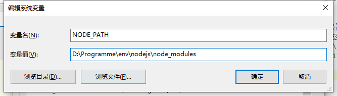
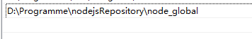

# nodejs的安装与配置

[nodejs安装并配置npm源](https://www.cnblogs.com/xianshen/p/15695453.html)


1. 配置npm安装全局模块路径和缓存cache路径
```shell
npm config set prefix "D:\Programme\nodejsRepository\node_global"

npm config set cache "D:\Programme\nodejsRepository\node_cache"
```

2. 设置环境变量
 系统变量中新建一个变量名为 “NODE_PATH”， 值为“F:\java\nodejs\node_modules”，如图：



编辑用户变量里的Path，将相应npm（C:\Users\用户名\AppData\Roaming路径下的npm）的路径改为：D:\Programme\nodejsRepository\node_global



node_global是下载插件路径

3. 配置npm源

- 配置源为淘宝仓库
npm config set registry https://registry.npm.taobao.org

- 下载时指定淘宝源
npm --registry=https://registry.npm.taobao.org install

